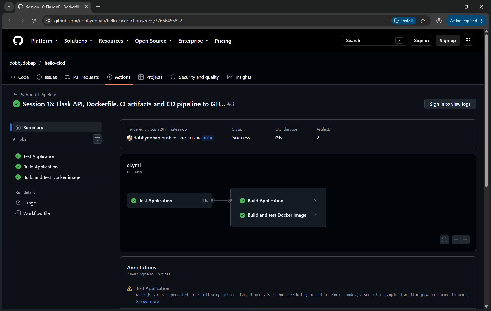
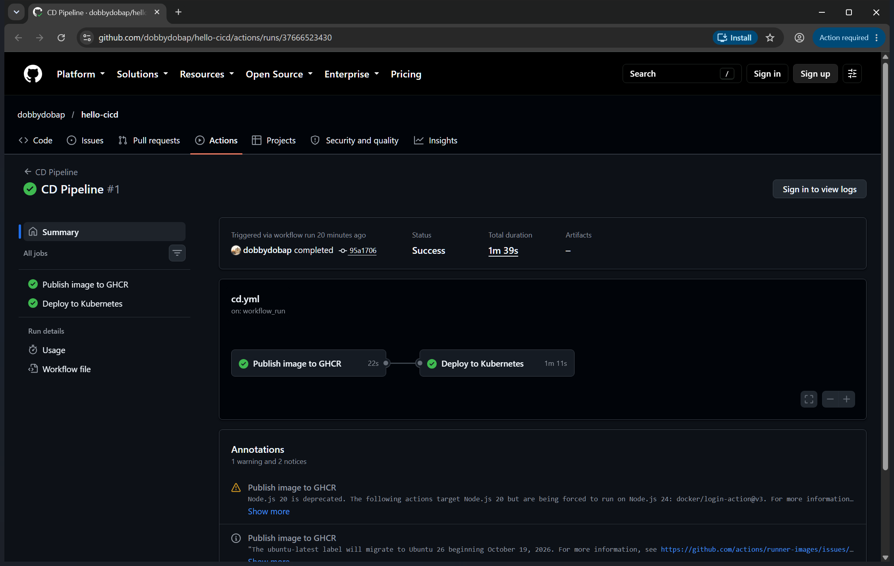
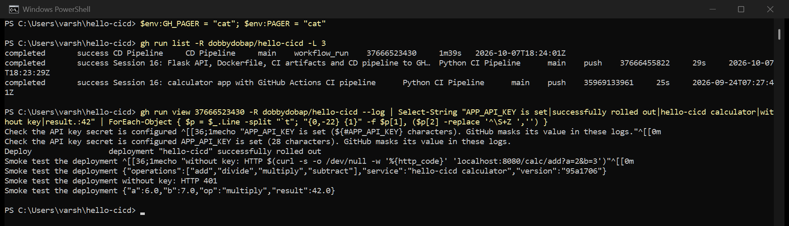

# hello-cicd

Session 16 — CI/CD with GitHub Actions.

A Python calculator with a small HTTP API, tests, a Docker image, and two pipelines: **CI** tests
and builds every push, and **CD** publishes the image and deploys it to Kubernetes once CI passes.

## What is in here

| Path | What it is |
|---|---|
| `app/calculator.py` | The calculator — add, subtract, multiply, divide |
| `app/web.py` | Flask HTTP API around it: `/`, `/health`, `/calc/<op>?a=&b=` |
| `tests/` | 12 pytest tests — 5 for the calculator, 7 for the API |
| `Dockerfile` | Runs the API with gunicorn as a non-root user |
| `k8s/` | Deployment and Service for the CD pipeline |
| `build.sh` | Build script — copies the app into `build/` and writes build info |
| `.github/workflows/` | The workflows (below) |

## CI vs CD

| | CI — Continuous Integration | CD — Continuous Delivery / Deployment |
|---|---|---|
| Question it answers | does this change work? | can (and does) this change reach users? |
| Runs on | every push and pull request | only after CI passes on `main` |
| Here | test, build, build and run the Docker image | push image to GHCR, deploy to Kubernetes, smoke test |
| Output | a verdict and artifacts | a running deployment |

*Delivery* means every passing change is ready to release; *Deployment* means it's actually
released automatically. My CD pipeline goes all the way to deployment.

## The pipeline

```
git push to main
      |
      v
CI  (ci.yml) ──────────────────────────────────────────────────────┐
  test ──┬──> build            (build.sh, uploads calculator-build) │
         └──> docker           (build image, run it, check it)      │
      | only if CI succeeded                                         │
      v                                                              │
CD  (cd.yml, triggered by workflow_run) ─────────────────────────────┘
  publish ──> deploy
  (GHCR)      (kind cluster, kubectl rollout, smoke test)
```

## Workflows

| Workflow | Trigger | What it does |
|---|---|---|
| `ci.yml` | push / PR to main, manual | the CI pipeline |
| `cd.yml` | after CI succeeds on main, manual | the CD pipeline |
| `hello-actions.yml` | manual | prints a message, the date and the OS — the simplest possible workflow |
| `workflow-demo.yml` | manual | four steps in one job, to show step order |
| `jobs-steps.yml` | manual | two jobs running in parallel, to show jobs vs steps |

## GitHub Actions concepts, as used here

- **Workflow** — a YAML file in `.github/workflows/`. `ci.yml` and `cd.yml` are two workflows.
- **Trigger (`on:`)** — what starts it. CI runs on `push`/`pull_request`; CD uses `workflow_run`,
  so it starts **only when CI has finished**, and its first job checks
  `github.event.workflow_run.conclusion == 'success'`. Failing code never gets published.
- **Jobs** — run in parallel on separate machines unless linked with `needs:`. In CI, `build` and
  `docker` both `needs: test`, so they wait for the tests and then run side by side.
- **Steps** — run in order inside one job, sharing its filesystem. Each is either a shell command
  (`run:`) or a reusable action (`uses: actions/checkout@v6`).
- **Runners** — the machines. Every job uses `runs-on: ubuntu-latest`, a fresh GitHub-hosted VM
  that is thrown away afterwards, so nothing leaks between runs. A self-hosted runner would be
  needed to reach a private network.
- **Secrets** — two kinds here:
  - `GITHUB_TOKEN`, created automatically for every run, used to log in to GHCR.
  - `APP_API_KEY`, a repository secret I set (`gh secret set APP_API_KEY`). CD puts it into a
    Kubernetes Secret, and the app then requires it in an `X-API-Key` header. GitHub masks it as
    `***` everywhere in the logs.
- **Artifacts** — files kept after a run: `test-report` (JUnit XML, uploaded even if tests fail)
  and `calculator-build` (the `build/` folder).
- **Build** — `build.sh`, plus `docker build`.
- **Test** — `pytest -v` in CI, then a real check of the running container: no key → 401,
  with key → the right answer.

## Pipeline execution

### CI — all three jobs green



### CD — publish and deploy green



### What the CD pipeline actually did



From the deploy job's log:

- `APP_API_KEY is set (28 characters)` — the secret reached the job; its value shows only as `***`
- `deployment "hello-cicd" successfully rolled out` — on a kind cluster created on the runner
- the smoke test against the deployed pods:
  - `/` returned `"version": "95a1706"` — the short commit SHA, so the running app identifies
    exactly which commit it came from
  - `without key: HTTP 401` — the secret is enforced
  - `{"a":6.0,"b":7.0,"op":"multiply","result":42.0}` — with the key, the right answer

The image is published as `ghcr.io/dobbydobap/hello-cicd`, tagged with both the commit SHA and `latest`.

## Running it locally

```bash
python -m venv .venv
source .venv/Scripts/activate    # Windows: .\.venv\Scripts\Activate.ps1
pip install -r requirements.txt
pytest -v

docker build -t hello-cicd .
docker run -p 8000:8000 -e APP_API_KEY=local-key hello-cicd
curl -H "X-API-Key: local-key" "localhost:8000/calc/add?a=2&b=3"
```
